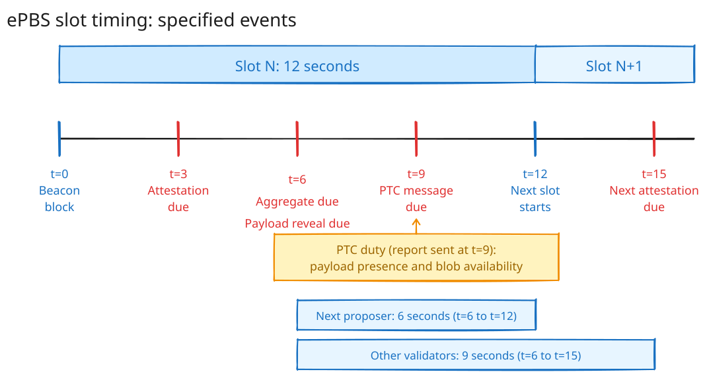

# Timing Foundations

This chapter defines the actors, events, time budgets, and builder proof model for the scenario analysis.

## Actors and events

The **builder** creates an execution payload and its execution proof.
Before bid selection, the builder freezes the payload and commits to it in a signed bid.

The **beacon proposer** publishes the beacon block. This block contains the selected payload commitment.

The **attesters** vote on the beacon block. They do not need the full execution result for their current-slot vote under ePBS.

The **Payload Timeliness Committee (PTC)** reports payload presence and blob availability.

The **proof verifier** verifies the proof. A mandatory-proof design must connect this result to block validity and fork choice.

Execution validation checks the payload result. Proof verification checks a cryptographic proof.

## Slot timing under ePBS

Under [EIP-7732](https://eips.ethereum.org/EIPS/eip-7732), Gloas keeps the 12-second slot. It divides this slot into four equal intervals.
The specification sets attestation at 25%, aggregation at 50%, and the PTC message at 75% of the slot.

| Time | Specified event |
| ---: | --- |
| `t=0` | The beacon proposer publishes the beacon block. |
| `t=3` | The current-slot attestation is due. |
| `t=6` | The attestation aggregate and execution-payload reveal are due. |
| `t=9` | The PTC message is due. |
| `t=12` | The next slot starts. |
| `t=15` | The next-slot attestation is due. |

The protocol payload-receipt deadline is `t=6`.
The deadline measures PTC receipt, not builder send time.
Therefore, the builder must reveal the payload early enough for it to arrive before `t=6`.
If a PTC member receives the payload before this deadline, it counts the payload as timely.
Then, the PTC sends its payload-attestation message at `t=9`.

EIP-7732 states two execution-validation budgets:

- The next proposer gets 6 seconds, from the `t=6` payload deadline to the next block proposal at `t=12`.
- Other validators get 9 seconds, from `t=6` to the next-slot attestation at `t=15`.

The next proposer needs the validation result before it builds block `N+1`. Other validators need the result before they attest to block `N+1`.

A network delay can make the local validation window shorter for a validator.

These budgets describe execution validation in the intended ePBS pipeline.
They do not define a proof-generation budget or a proof start.

## Gross and net proving time

**Gross proving time** is the time between the proof start and the protocol proof deadline.

`T_gross = T_deadline - T_start`

**Net proving time** removes all required work outside proof generation.

`T_net = T_deadline - T_start - T_witness - T_propagation - T_verification - T_margin`

The witness term includes witness creation and any data transfer inside the proving system of the builder.
The propagation term includes proof distribution across the peer-to-peer network.
The verification term includes cryptographic proof verification. The margin term protects slow nodes and adverse network conditions.
The builder cannot use the full interval before the protocol deadline for proof generation. Each additional term reduces net proving time.

## Builder proof model

The builder freezes its payload before bid selection and payload reveal.
This payload freeze starts proof generation.
In this model, proving hardware and proof reliability affect block construction.
The exact payload freeze can occur before `t=0`.
The protocol specifies neither the payload-freeze time nor the proof deadline.
Later chapters use `t≈0` only as a rounded reference assumption.
Therefore, a numeric value for gross proving time requires a separate mandatory-proof design.
