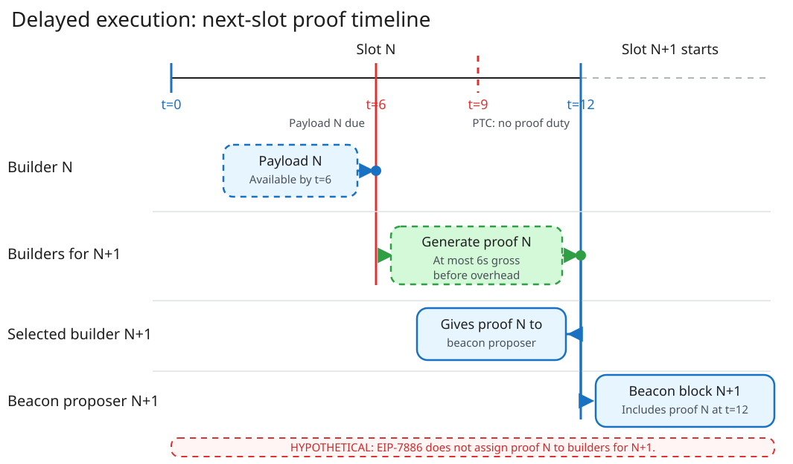

# Scenario 3: ePBS with Delayed Execution

!!! abstract "Key point"

    Delayed execution can move proof `N` to candidate builders for block `N+1`.
    Under ePBS, payload `N` can arrive near `t=6`.
    This timing leaves at most 6 seconds before beacon block `N+1` at `t=12`.
    In this hypothetical model, beacon block `N+1` carries proof `N`.
    This guide still uses builder-owned proofs as its primary model.

## How the proof path changes

In the builder-owned model, builder `N` proves its own payload.
Proof generation starts when the builder freezes payload `N`.

An alternative model assigns proof `N` to candidate builders for block `N+1`.
These builders start after they receive payload `N`.
The selected builder gives proof `N` to the beacon proposer.
The beacon proposer includes proof `N` in beacon block `N+1` at `t=12`.

| Model | Proof path for block `N` | Timing result |
| --- | --- | --- |
| Builder-owned | Builder `N` freezes payload `N` → proves `N` → publishes the proof by a separate deadline | Delayed execution does not set additional time |
| Next-slot, with ePBS | Payload `N` can arrive at `t=6` → builders for `N+1` prove `N` → selected builder gives proof `N` to the proposer by `t=12` | At most 6 seconds before overhead |

The two models also have different availability properties.
A builder-owned proof can become a separate object that the builder can withhold or release selectively.
A committee signal can report proof availability before the next proposer selects a parent.
EIP-7886 does not define this signal.

The next-slot model removes the separate proof handoff from builder `N`.
It adds a handoff from the selected builder for `N+1` to the beacon proposer.
The execution payload for block `N+1` is not due until `t=18`.
Therefore, that payload cannot carry a proof that the beacon block requires at `t=12`.
Candidate builders must also repeat the same proof work before builder selection.

## Effect on proving time

A one-slot estimate assumes that payload `N` is available near `t=0`.
This assumption does not hold under ePBS.

With ePBS, payload `N` can arrive near the `t=6` payload deadline.
Block `N+1` starts at `t=12`.
Therefore, candidate builders can have at most 6 seconds of gross proving time in this case.
Payload receipt and the handoff to the proposer can make the local window shorter.
Witness creation, proof propagation, verification, and a safety margin reduce the net proving time.

In the builder-owned model, proof generation still starts at payload freeze.
Delayed execution does not extend this window unless a separate design sets a later proof deadline.

## What the protocol delays

The diagram shows the hypothetical next-slot proof model under ePBS.

