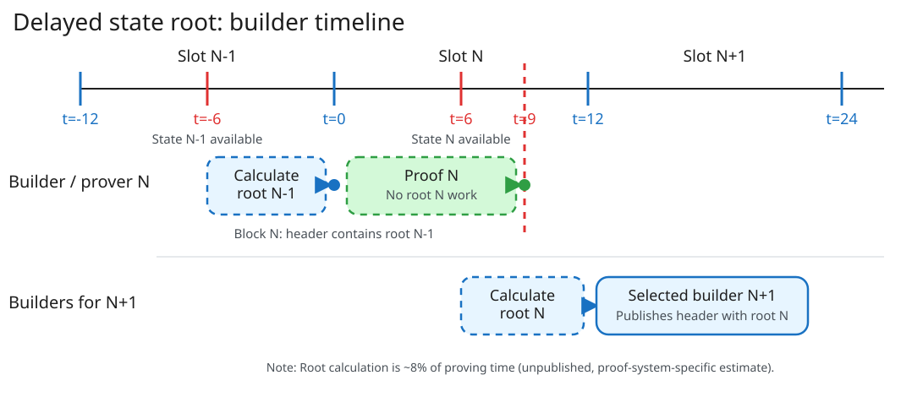

# Scenario 2: ePBS with Delayed State Root

!!! abstract "Key point"

    Delayed state root moves post-state-root calculation out of the proving hot path for block `N`.
    An unpublished estimate measures this calculation at approximately 8% of total block proving time.
    This estimate is proof-system-specific. Post-Glamsterdam measurements must replace it (probably will be lower).
    The design does not increase gross proving time. It reduces the work that must finish inside the same proving window.

## How the proving hot path changes

In the current design, block `N` contains its own post-state root.
The prover must calculate this root before it finishes a proof that commits to the root.

With delayed state root, block `N` contains the post-state root of block `N-1`.
Candidate builders for block `N` calculate root `N-1` during slot `N-1`.
The selected builder includes root `N-1` in block `N`.
The proof for block `N` can finish without its post-state root only under a separate proof-design assumption.
Candidate builders for block `N+1` calculate root `N` during slot `N`.
The selected builder includes root `N` in block `N+1`.

This benefit requires proof `N` to finish without root `N` before its deadline.
EIP-7862 does not define the public inputs for a mandatory proof.

| Design | Hot path for block `N` | Later work |
| --- | --- | --- |
| Current state root | Execute block `N` → calculate root `N` → finish proof `N` | None |
| Delayed state root | Execute block `N` → finish proof `N` without root `N` | Builders for `N+1` calculate root `N` → selected builder includes it in block `N+1` |

## Effect on proving time

Our estimate measured post-state-root calculation at approximately 8% of total block proving time.
This estimate is specific to the measured proof system. Post-Glamsterdam measurements must replace the estimate.
Delayed state root can move this work out of the proving hot path.

If the baseline proving time is `T_baseline`, the remaining hot-path work is approximately `0.92 × T_baseline`.
This value is a reduction in time-critical work. It is not an additional proving-time budget.

Proof integration or aggregation can add overhead.
This analysis does not estimate that overhead.

The network still calculates every post-state root.
Candidate builders for block `N+1` calculate root `N` during slot `N`.
The selected builder includes this root in block `N+1`.

## What the protocol delays

[EIP-7862](https://eips.ethereum.org/EIPS/eip-7862) changes the state root in the execution header.
Block `N` contains the post-state root of block `N-1`.
Block `N+1` contains the post-state root of block `N`.
Transaction execution order does not change.

## What does not change

The builder proof starts at payload freeze, as in the ePBS baseline.
EIP-7862 does not change the proof deadline.
A separate mandatory-proof design must set that deadline.
The baseline 6-second and 9-second validation budgets remain.

This comparison holds witness creation, proof propagation, verification, and margin costs constant.
Under this comparison, gross proving time stays equal to the ePBS baseline.
