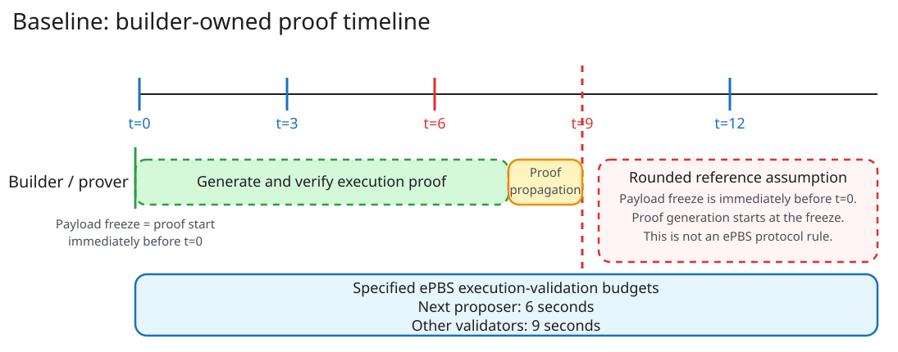
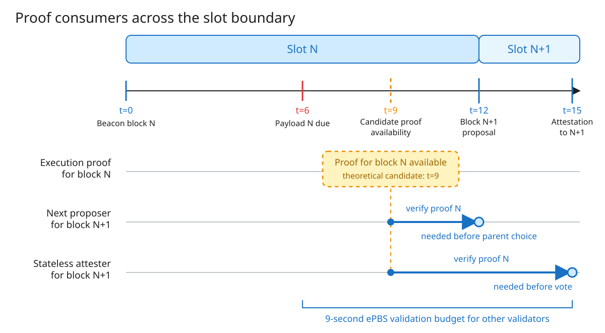

# Scenario 1: ePBS Baseline

!!! abstract "Key point"

    ePBS gives 6-second and 9-second validation budgets. It does not define a deadline for mandatory proofs.

## What the protocol delays

ePBS delays full execution-payload validation beyond the current-slot attestation. It also separates the beacon block from the execution payload.

## When proving starts

The builder starts proof generation when it freezes the payload.
This freeze occurs before the beacon proposer selects the builder bid.
EIP-7732 does not specify the exact freeze time.

## Builder proof timeline

The diagram applies the builder proof model to the ePBS slot.
It places payload freeze immediately before `t=0` and rounds this time to `t≈0`.
It shows proof availability at `t=9` as a mandatory-proof assumption, not as specified ePBS behavior.

## Which event sets the deadline

[EIP-7732](https://eips.ethereum.org/EIPS/eip-7732) does not set a mandatory-proof deadline.
It gives the next proposer 6 seconds and other validators 9 seconds for execution validation.

In baseline ePBS, the PTC reports payload presence and blob availability at `t=9`. It does not verify execution proofs.

## Theoretical justification for a proof deadline

This section describes a possible mandatory-proof design. It does not describe current EIP-7732 behavior.

### Why not `t=15` as the proof deadline?

`t=15` is a natural first deadline in a design for stateless attesters.
In this design, the execution proof replaces local execution validation.
At `t=15`, validators attest to block `N+1` and need the proof for block `N` before that vote.
The interval from the `t=6` payload deadline to `t=15` matches the 9-second ePBS validation budget for these validators.
However, a stateless validator can also be the next proposer, which creates an earlier dependency at `t=12`.

### Why `t=15` is too late

For slot `N`, the next proposer publishes block `N+1` at `t=12`.
The proposer must select the fork-choice head and a safe execution parent before publication.

If the proof for block `N` arrives at `t=15`, the proposer publishes block `N+1` three seconds earlier.
This deadline is too late when the protocol makes block `N` validity depend on that proof.

If the proposer builds on block `N` before proof arrival, the proof can later be missing or invalid.
Block `N+1` then depends on a parent that the protocol cannot accept.
The design must guarantee the proof before `t=12` or define rules for descendants of unproven blocks.

The selected next proposer must be able to obtain and verify the proof before `t=12`.
If proof availability affects fork choice, the protocol also needs a network-visible availability signal.

### Why `t=9` and the PTC are candidates

EIP-7732 already places the PTC message deadline at `t=9`.
This event occurs three seconds before the next proposal at `t=12`.

A mandatory-proof design can extend the PTC report to include timely proof availability.
The report can state that committee members received the proof for the committed payload before a defined cutoff.
Fork choice can then use this committee signal before the next proposer selects its parent.

This possible PTC duty concerns proof availability, not proof validity.
Each node can verify the proof locally.
The design must reserve time for proof propagation, proof verification, fork-choice computation, and a safety margin.

The proof-receipt cutoff and the PTC message deadline are separate events.
If the PTC message remains due at `t=9`, committee members must receive the proof early enough to report by `t=9`.
A mandatory-proof design must define this earlier cutoff and the required committee threshold.

In this context, an acceptable block has an execution result that passes the required proof verification.
A PTC availability report reduces uncertainty about a missing proof. It does not replace proof verification.

The diagram uses proof availability at `t=9` only as an assumption.
EIP-7732 does not give the PTC a proof-availability or proof-verification duty.
